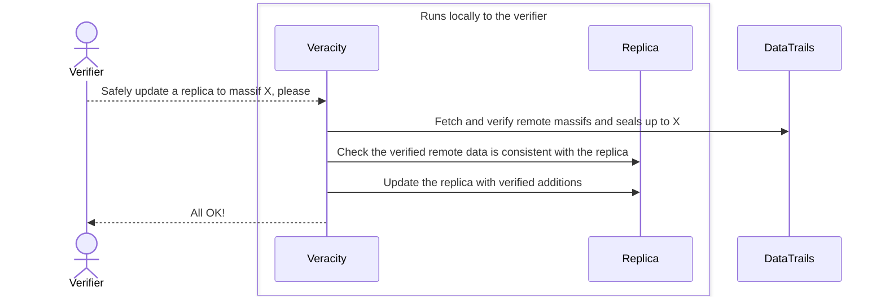
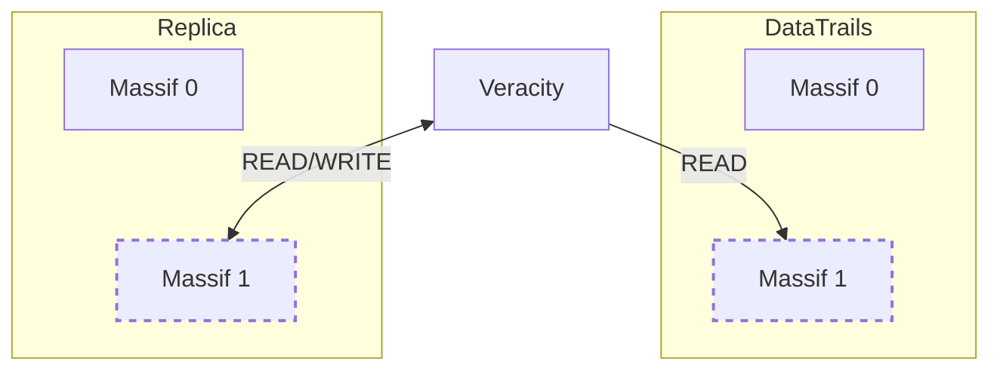
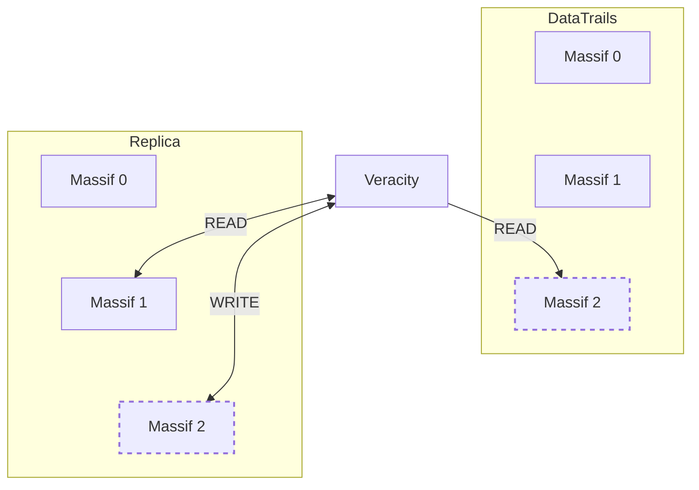
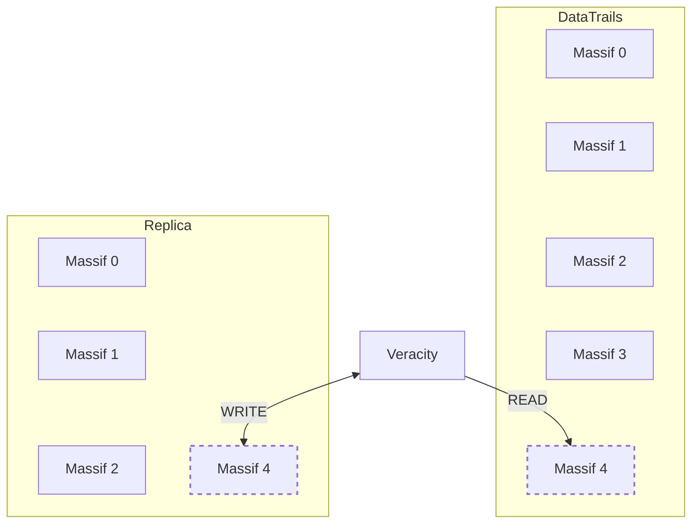

## Overview

The DataTrails ledger is a log that can be distributed.
When a replicated copy of a merkle log is held by an independent party, it is impossible for DataTrails to modify a log to refute claims.
It is impossible for a malicious attacker, on the DataTrails ledger, to know they have successfully changed all copies of the log, and if they miss just one copy they have failed.
The independent party, can be, and may often be, the original DataTrails tenant.

 If tamper detection is the requirement, it is not necessary to replicate any log data at all

This article describes how to achieve the following guarantees of verifiability independently of DataTrails:

1. **The guarantee of non-falsifiability**: Event data can not be falsified.
1. **The guarantee of non-repudiation**: Event data can not be removed.
1. **The guarantee of provability**: Event data can be proven to be correct (creating proofs does not require the original event data).
1. **The guarantee of demonstrable completeness**: A series of events (trails), can be proven to be complete.

In all of these guarantees, if DataTrails is compromised, a replica holder can independently prove if event data was modified, removed, inserted or re-ordered.

These guarantees require a replicated copy of the *relevant* ledger massifs and the seal for those massifs.
The seal is the log checkpoint, signed by DataTrails, which attests to the log state up to that point.
These guarantees do not require a copy of the event data stored in DataTrails.

If the DataTrails event data is additionally retained, an additional guarantee that regular data corruption can be detected is made.
This corruption detection is also known as an audit.
To perform an audit, the event data for every event to be audited is required.
If a full audit (all of the ledger) is required then all of the event data is required.

DataTrail's log format makes it simple to retain only the portions (massifs) of the log that are interesting.
Discarding un-interesting portions does not affect the independence or verifiability of the retained log.

Simplistic tampering attacks, where the the verifiable data is then unable to "prove" the tampered elements, are equivalent to data corruption

## Maintaining a Tamper Evident Log Replica

Based on a window of assurance, a replica may be maintained with one command, once a week.

- Running the following command once a week, will make all tenant activity for that week Tamper Evident.

  
  

  ```bash
  veracity watch --horizon 180h | \
    veracity \
    replicate-logs --replicadir merklelogs
  ```

  
  

 Larger time horizons may trigger rate limiting

Maintaining a copy of the event data recorded by DataTrails renders the tenants event data as Tamper Proof as the copies may be compared for accuracy.

The remainder of this article discusses the commands `replicate-logs` and `watch` in more depth, covering how to replicate selective tenants, explaining the significance of the replicated materials.

## How Veracity Supports These Guarantees

See [Independently verifying DataTrails transparent merkle logs](/developers/developer-patterns/veracity/) for a general introduction to `veracity`.

This diagram illustrates the logical flow when updating a local replica using veracity.

---



---

The guarantees of *non-falsifiability* and *non-repudiation* require replication and verification of at least the most recently updated massif.
They further require that the replica is updated often enough to capture all massifs.
As a massif, in the default tenant configuration, contains over 16,000 events, the frequency necessary to support this guarantee is both low, and completely determined by the specific tenant of interest.

The guarantees of *provability* and *demonstrable completeness* require retention of any local massif that contains an event that is still of value.

Saving the API response data when events are recoded, or obtaining the event data using the DataTrails events API, is additionally required in order to support a fully audit for data corruption.

With a trusted local copy of the verifiable data, even after a tamper is detected, it is reasonable to rely on DataTrails storage of the event data.
When the event is fetched, if it can be verified against the replica, it proves that the DataTrails storage of the event remains correct.
If it does not, it is proven that both the DataTrails log and a tenants merkle log have been improperly updated.

DataTrails is a platform for sharing *meta* data. And typically, a DataTrails event contains a commitment (a hash of) some other material: An AI Model Card, An SBOM, or an image or video. DataTrails does not handle the original material at all.

In the extreme case, where the DataTrails ledger is corrupted, relying parties can instantly detect the inconsistency.
With detection, the relying party *knows* the original content could very well be trustworthy, and can justify more involved processes to re-acquire it.
And, importantly, it is impossible for DataTrails to collude, or be coerced, in away that provably refutes the content owner or relying parties claims.
All parties that have shared that event data are also able to replicate and verify the event inclusion in all copies of the log.

Each of these guarantees is accomplished using the `veracity` `replicate-logs` and `watch` commands to check the log operation and replicate some or all of log data.

- `veracity watch` provides which tenants have log updates needing to be considered for replication.
- `veracity replicate-logs` performs the activities in the diagram above.
It can be directed to examine a specific tenant, or it can be provided with the output of `veracity watch`

### Updating the Currently Open Massif

Every DataTrails log is a series of one or more massifs.
The last, called the head, is where the verification data for new events are recorded.
Once the head is full, a new head automatically starts.

There are 3 basic scenarios `veracity` copes with when updating a replica:

1. Updating the currently open replicated massif with the new additions in the DataTrails open massif.
1. Replicating the start of a new open massif from DataTrails.
1. Replicating a limited number of new massifs from DataTrails, performing local consistency checks only if the replicated massifs follow the latest local massif.

The first is the simplest to understand. In the diagram below the dashed boxes correspond to the open massifs.

The local replica of the open massif will always be equal or less in size than the remote.
Once veracity verifies the remote copy is consistent with the remote seal, it will then check the new data copied from the remote is consistent with its local copy of the open massif.
Consistent simply means it is an append, and that the remote has not "dropped" anything that it contained the last time it was replicated.

If there is any discrepancy in any of these checks, the current local data is left unchanged.



### Replicating the Next Open Massif

The local replica starts out only having Massifs 0 & 1.
And 1 happens to be complete.
On the next event recorded by DataTrails, a new remote massif, Massif 2, is created.
More events may be recorded before the replica is updated.
Each massif contains verification data for a little over 16,000 events.
Provided the replication commands are run before Massif 2 is also filled.

The local Massif 1 is read because, before copying the remote Massif 2 into the local replica, its consistency against both the remote seal *and* the previous *local* massif, Massif 1, are checked.

Once those checks are successfully made, the local replica gains its initial copy of Massif 2.



### Replicating, but Leaving a Gap

By default, veracity will fetch and verify all massifs, up to the requested, that follow on immediately after the most recent local massif.
In this case, where `--massif 4` is requested, the default would fetch, verify and replicate Massifs 2, 3 & 4.

By default, a full tenant log is replicated.
The storage requirements are roughly 4mb per massif, and each massif has the verification data for about 16,000 events.

To provide a means to bound the size of the local replica and also to bound the amount of work, DataTrails provides an `--ancestors` option.
This specifies a fixed limit on the number of massifs that will be fetched.
In this example, the limit is `0`, meaning massif 4 is fetched and verified, and we leave a *gap* between the local massifs 2 & the new local massif 4.
The gap means the consistency of the remote massif 4 is *not* checked against the local replica.

The command `veracity replicate-logs --ancestors 0 --massif 4` requests that massif 4 is verified and then replicated locally, but prevents it from being verified for consistency against the current local replica.



## Environment Configuration for Veracity

The `veracity replicate-logs` command provides a convenient and reliable way to create and maintain merkle log replicas for multiple tenants.

Use the following configuration:

```bash
# DataTrails Public Tenant
export PUBLIC_TENANT="tenant/6ea5cd00-c711-3649-6914-7b125928bbb4"

# Synsation Demo Tenant
# Replace TENANT with your Tenant ID to view your Tenant logs and events
export TENANT="tenant/6a009b40-eb55-4159-81f0-69024f89f53c"
```

## Replicating the Log for the Public Tenant

If replication of a specific tenant is desired, then both the `watch` command and the `replicate-logs` command can be provided with a tenant, or list of tenants, to consider.


   

  ```bash
  veracity --tenant $PUBLIC_TENANT watch
  ```

  Generates output similar to:

  ```json
  [
    {
      "massifindex": 1,
      "tenant": "tenant/6ea5cd00-c711-3649-6914-7b125928bbb4",
      "idcommitted": "0191c424e62d04b300",
      "idconfirmed": "0191c424e62d04b300",
      "lastmodified": "2024-09-05T21:43:58Z",
      "massif": "v1/mmrs/tenant/6ea5cd00-c711-3649-6914-7b125928bbb4/0/massifs/0000000000000001.log",
      "seal": "v1/mmrs/tenant/6ea5cd00-c711-3649-6914-7b125928bbb4/0/massifseals/0000000000000001.sth"
    }
  ]
  ```

  If instead you get:

  ```output
  error: no changes found
  ```

   There has been no activity in any tenant for the default watch horizon (how far back we look for changes).

   To set an explicit, and in this example very large, horizon try the following:

   ```bash
   veracity watch --horizon 10000h
   ```

  


The `watch` command is used to determine the `massifindex`, even when you are only interested in a single tenant.
You then provide that index to the `replicate-logs` command using the `--massif` option:

  
  

  ```bash
  veracity \
      --tenant $PUBLIC_TENANT \
      replicate-logs --massif 1 \
      --replicadir merklelogs

  find merklelogs -type f
  ```

  Generates output similar to:

  ```output
  merklelogs/tenant/6ea5cd00-c711-3649-6914-7b125928bbb4/0/massifs/0000000000000001.log
  merklelogs/tenant/6ea5cd00-c711-3649-6914-7b125928bbb4/0/massifs/0000000000000000.log
  merklelogs/tenant/6ea5cd00-c711-3649-6914-7b125928bbb4/0/massifseals/0000000000000000.sth
  merklelogs/tenant/6ea5cd00-c711-3649-6914-7b125928bbb4/0/massifseals/0000000000000001.sth
  ```

  
  

By default, all massifs up to and including the massif specified by `--massif <N>` are verified remotely and checked for consistency against the local replica (following the logical steps in the diagram above).

The numbered `.log` files are the verifiable data for your log.

The `.sth` files are [COSE Sign1](https://datatracker.ietf.org/doc/html/rfc8152#section-4.2) binary format signed messages.
Each `.sth` is associated with the identically numbered massif.
The log root material in the `.sth` signature attests to the entire state of the log up to the end of the associated massif.

## Takeaways

To be sure mistaken, or malicious, acts on the DataTrails service can always be detected run this command about once a week:




```bash
veracity watch --horizon 180h | \
  veracity replicate-logs --replicadir merklelogs
```




This process guarantees DataTrails logs can't be misrepresented, any alternate version of events would be provably false.

If you need to verify that DataTrails has correctly recorded your data in the first place, you need to check the event data recorded in our platform.

If you want to guarantee you can always verify your original recorded event, you must keep a copy of the DataTrails event.

You can choose to trust a DataTrails copy, because even in the most extreme cases, it is provable if DataTrails has been compromised.

In scenarios where you are attesting to primary data that is held elsewhere, this is usually more than sufficient.
