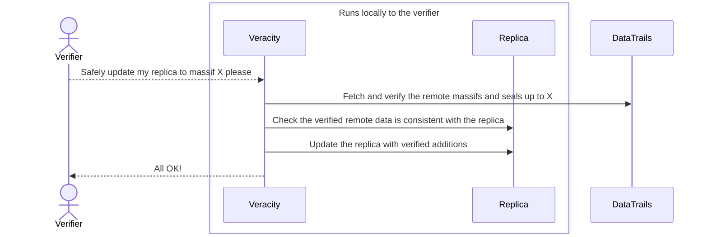
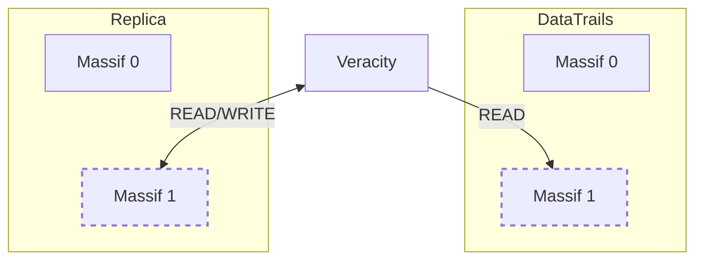
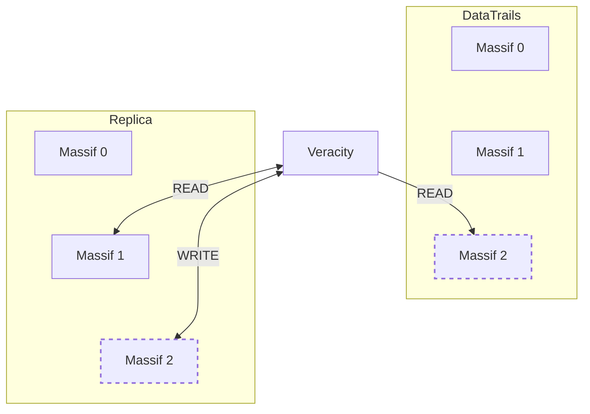
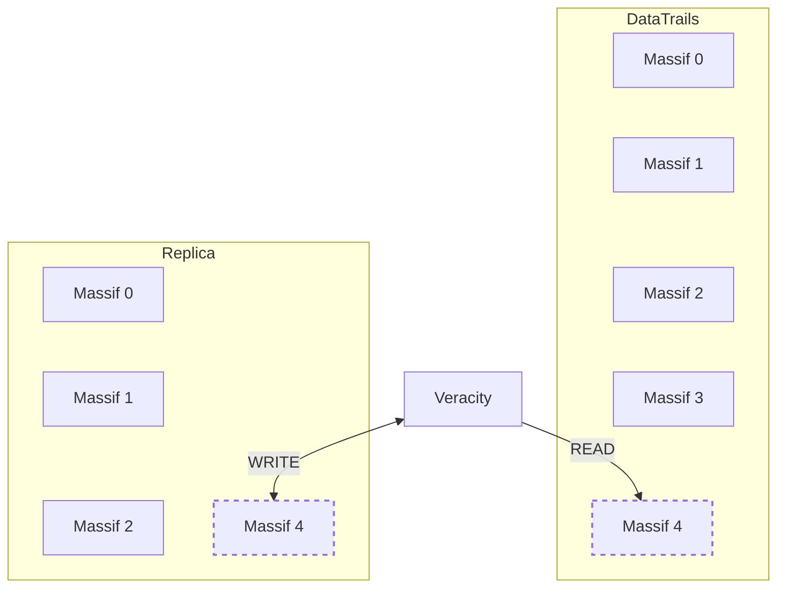

## Overview

The DataTrails ledger is a log that can be distributed.
When a replicated copy of a merkle log is held by an independent party, it is impossible for DataTrails to modify a log to refute claims.
It is also impossible for any attacker to know they have accounted for all copies of the log, and if they miss just one copy they have failed.


 If tamper detection is the requirement, it is not necessary to replicate any log data at all

This article describes how to achieve the following guarantees of verifiability independently of DataTrails:

1. The guarantee of non-falsifiability: That event data can not be falsified.
1. The guarantee of non-repudiation: That event data can not be removed.
1. The guarantee of provability: That event data can be proven to be correct (creating these proofs does not require the original event data).
1. The guarantee of demonstrable completeness: That series of events (trails), can be proven to be complete.

In all of these guarantees, if DataTrails is compromised, a replica holder can independently prove if event data was modified, removed, inserted or re-ordered.

These guarantees require a replicated copy of the *relevant* ledger massifs and the seal for those massifs.
The seal is the log checkpoint, signed by DataTrails, which attests to the log state up to that point.
These guarantees do not require a copy of the event data stored in DataTrails.

If the DataTrails event data is additionaly retained, an additional guarantee that regular data corruption can be detected is made.
This corruption detection is also known as an audit.
To perform an audit, the event data for every event to be audited is required.
If a full audit (all of the ledger) is required then all of the event data is required.

DataTrail's log format makes it simple to retain only the portions (massifs) of the log that are interesting.
Discarding un-interesting portions does not affect the indpendence or verifiability of the retained log.

Simplistic tampering attacks, where the the verifiable data is then unable to "prove" the tampered elements, are equivelent to data corruption

If the steps outlined in this article are performed for a tenant, then the tenants event data is Tamper Evident.

If a copy of the event data recorded by DataTrails is retained, or available at the time of dispute, then the tenants event data is Tamper Proof.

## How veracity supports these guarantees

In this remainder of this article explains how to use `veracity` to maintain the replicated log data necessary to support these guarantees.

See [Independently verifying DataTrails transparent merkle logs](/developers/developer-patterns/veracity/) for a general introduction to `veracity`.

This diagram illustrates the logcical flow when updating a local replica using veracity.

---



---


The first two guarantees require replication and verification of at least the most recently updated massif.
They further require that the replica is updated often enough not to miss massifs.
As a massif, in the default tenant configuration, contains over 16,000 events, the frequency necessary to support this guarantee is both low, and completely determined by the specific tenant of interest.

The second two guarantees require retention of any local massif that contains an event that is still of value.

Saving the API response data when events are recored, or obtaining the event data using the DataTrails events API, is additionaly required in order to support a fully audit for data corruption.

With a trusted local copy of the verifiable data, even after a tamper is detected, it is reasonable to rely on DataTrails storage of the event data.

When the event is fetched, if it can be verified against the replica, it proves that the DataTrails storage of the event remains correct.
If it does not, it is proven that both the DataTrails log and a tenants merkle log have been improperly updated.

All parties that have shared that event data are also able to replicate and verify the event inclusion in all copies of the log.

Each of these guarantees is accomplished using the `veracity` `replicate-logs` and `watch` commands to check the log operation and replicate some or all of log data.

* `veracity watch` is used to give notice of which tenants have updates to their logs that need to be considered for replication.
* `veracity replicate-logs` performs the activitys in the diagram above. It can be directed to examin a specific tenant, or it can be provided with the output of `veracity watch`

### Updating the currently open massif

Every DataTrails log is a series of one or more massifs.
The last, which we call the head, is where the verification data for new events are recored.
Once the head is full, a new head automatically starts.

This means there are 3 basic scenarios `veracity` copes with when updating a replica.

1. Updating the currently open replicated massif with the new additions in the DataTrails open massif.
1. Replicating the start of a new open massif from DataTrails.
1. Replicating a limited number of new massifs from DataTrails, performing local consistency checks only if the replicated massifs follow the latest local massif.

The first is the simplest to understand. In the diagram below the dashed boxes correspond to the open massifs.

The local replica of the open massif will always be equal or less in size than
the remote.  Once veracity verifies the remote copy is consistent with the
remote seal, it will then check the new data copied from the remote is
consistent with its local copy of the open massif. Consistent simply means it is
an append, and that the remote has not "droped" anything that it contained the
last time it was replicated.

If there is any discrepancy in any of these checks, the current local data is left unchanged.



### Replicating the next open massif



### Replicating, but leaving a gap

The command `veracity replicate-logs --ancestors 0 --massifs 4` requests that massif 5 is verified and then replicated locally.
By default, this would caus



After this gap is created it can be filled by running

The command `veracity replicate-logs --massifs 3`

But this must be done explicitly, by default, the `repicate-logs` command only considers the local head for consistency purposes and will not automatically back fill gaps or re-verify.

## Environment Configuration for Veracity

The `veracity replicate-logs` command provides a convenient and reliable way to create and maintain merkle log replicas for multiple tenants.

Use the following configuration:

```bash
# DataTrails Public Tenant
export PUBLIC_TENANT="tenant/6ea5cd00-c711-3649-6914-7b125928bbb4"

# Synsation Demo Tenant
# Replace TENANT with your Tenant ID to view your Tenant logs and events
export TENANT="tenant/6a009b40-eb55-4159-81f0-69024f89f53c"
```

## Replicating the Log for the Public Tenant

To get a sense of how `replicate-logs` works replicate the public tenant's log

- Use Replicate-Logs to Create a Local, Verified, Replica of the Datatrails Public Tenant Log

  
    

  ```bash
  veracity --data-url https://app.datatrails.ai/verifiabledata \
      --tenant $PUBLIC_TENANT \
      replicate-logs --massif 0 \
      --replicadir merklelogs

  find merklelogs -type f
  ```

  Generates output similar to:

  ```output
  merklelogs/tenant/6ea5cd00-c711-3649-6914-7b125928bbb4/0/massifs/0000000000000000.log
  merklelogs/tenant/6ea5cd00-c711-3649-6914-7b125928bbb4/0/massifseals/0000000000000000.sth
  ```

    
  

By default, all massifs up to and including the massif specified by `--massif <N>` are verified remotely and checked for consistency against the local replica (following the logical steps in the diagram above).
At the time of writing, the production public tenant merkle log has not filled its first massif yet.

## Finding Tenants With Log Additions

`veracity watch` will describe the activity for all tenants that have been recently added events to their merkle log:


   

  ```bash
  veracity watch
  ```

  Generates output similar to:

  ```json
  [
    {
      "massifindex": 0,
      "tenant": "6a009b40-eb55-4159-81f0-69024f89f53c",
      "idcommitted": "019176f5796d068500",
      "idconfirmed": "019176f5796d068500",
      "lastmodified": "2024-08-21T22:01:24Z",
      "massif": "v1/mmrs/tenant/6a009b40-eb55-4159-81f0-69024f89f53c/0/massifs/0000000000000000.log",
      "seal": "v1/mmrs/tenant/6a009b40-eb55-4159-81f0-69024f89f53c/0/massifseals/0000000000000000.sth"
    }
  ]
  ```

  If instead you get:

  ```output
  error: no changes found
  ```

   There has been no activity in any tenant for the default watch horizon (how far back we look for changes).

   To set an explicit, and in this example very large, horizon try the following:

   ```bash
   veracity watch --horizon 10000h
   ```

  


## Replicating the Logs for the Tenants With Activity

To automatically replicate the logs that changes are detected for, pipe the output of `watch` into `replicate-logs`

- Replicate the logs for all tenants that have been active in the default time horizon

  
    

  ```bash
  veracity watch | \
    veracity \
    replicate-logs --replicadir merklelogs
  ```

    
  

 Take care with larger time horizons, it may trigger issues with rate limiting.

## Replicating Just the Latest Changes to Your Log

By default, a full tenant log is replicated.
The storage requirements are roughly 4mb per massif, and each massif has the verification data for about 16000 events.

In many scenarios, independent verification can be achieved by replicating the most recently extended massif.

This is always sufficient to detect a tamper.
When a tamper or inconsistency is detected the most recently verified log data will not be changed.

It's not necessary to keep a full replica of a log, if only interested in more recent items.