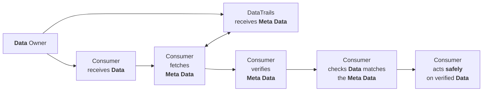

## Introduction

Without the measures described in this article, it is still extremely challenging to compromise a transparancy solution based on DataTrails.

To do so, the systems of more than just Data Trails need to be compromised in very specific ways.
To ilustrate this, consider this typical flow for how **Data** can be used in a transparent and tamper evident way with Data Trails.




This is already a very robust process. For this process to fail, the following steps must all be accomplished:

1. The source of the Data, which may not be the Owner, must be compromised to substitute the malicious Data.
1. Owner authentication of the Data, such as adding a signed digest in the Meta Data, must be compromised.
1. The DataTrails SaaS database must be compromised.
1. The DataTrails ledger must be compromised and re-built and re-signed.

Executing such an attack successfully would require significant effort and infiltration of both the Data source and DataTrails.
Nonetheless, for use-cases where even this small degree of trust in Data Trails is un-acceptable, the recipes in this article ensure the following guarantees are fully independent of Data Trails:

1. The guarantee of non-falsifiability: That event data can not be falsified.
1. The guarantee of non-repudiation: That event data can not be removed from the record (ie 'shredded' or deleted).
1. The guarantee of provability: That event data held *here and now* can be proven to be identical to the data created *there and then* (creating these proofs does not require the original event data).
1. The guarantee of demonstrable completeness: That series of events (trails), can be proven to be complete with no gaps or omissions.

These guarantees are "fail safe" against regular data corruption of the log data.
In the event of individial log entry corruption, verification checks would fail for that entry.

All modifications to the ledger which result in provable changes can be detected without a fully auditable replica.
By maintaining a fully auditable replica, continued verifiable operation is possible even if Data Trails is prevented from operating.
To provide this capability, checking that all **Meta Data** is exactly as was originally recorded, A copy of the Meta Data must also be replicated.
In cases where this capability is required, data retention remains managable and has completely predictable storage requirements.
The log format makes it operationaly very simple to discard data that ceases to be interesting.

The *Meta Data* is returned to the Owner when the event is recorded and is available from the regular API endpoints to any other authorized party, and obtaining it is not covered in this article.

## Replication Recipes

## Environment Configuration for Veracity


The following recipies make use of these environment:

```bash
# DataTrails Public Tenant
export PUBLIC_TENANT="tenant/6ea5cd00-c711-3649-6914-7b125928bbb4"

# Synsation Demo Tenant
# Replace TENANT with your Tenant ID to view your Tenant logs and events
export TENANT="tenant/6a009b40-eb55-4159-81f0-69024f89f53c"
```

### One command, once a week, to maintain a tamper evident log replica

A guarantee that actions are only taken on verified data can be achieved by running the following command once a week.

  
  

  ```bash
  veracity watch --horizon 180h | \
    veracity \
    replicate-logs --replicadir merklelogs

  # Run this to see what it replicated
  find merklelogs -type f
  ```

  Generates output similar to:

  ```output
  merklelogs/tenant/6ea5cd00-c711-3649-6914-7b125928bbb4/0/massifs/0000000000000001.log
  merklelogs/tenant/6ea5cd00-c711-3649-6914-7b125928bbb4/0/massifs/0000000000000000.log
  merklelogs/tenant/6ea5cd00-c711-3649-6914-7b125928bbb4/0/massifseals/0000000000000000.sth
  merklelogs/tenant/6ea5cd00-c711-3649-6914-7b125928bbb4/0/massifseals/0000000000000001.sth
  ```

  
  

A sensible value for `--horizon` is just a little (hours is more than enough) longer than the interval between updates.
To *miss* an update for a tenant, more than 16,000 events would need to be recorded in the interval.

 Take care with larger time horizons, it may trigger issues with rate limiting.

### Initializing a replica for all tenants

If a replica of all DataTrails tenants is required, run the previous command with a very long horizon.

  
    

  ```bash
  veracity watch --horizon 90000h | \
    veracity \
    replicate-logs --replicadir merklelogs
  ```
    
  

Having done this once, you should revert to using a horizon that is just a little longer than your update interval.

### Limiting the replica to specific tenants

The previous command will replicate the logs of all tenants.
This requires about 3.5 megabytes per 16,000 events.

To restrict a replica to a specific set of tenants, specify those tenants to the `watch` command.

A common requirement is the public attestation tenant and your own tenant, to accomplish this set $TENANT accordingly and run the following once a week.

  
    

  ```bash
  veracity watch --horizon 180h --tenant "$PUBLIC_TENANT,$TENANT" | \
    veracity \
    replicate-logs --replicadir merklelogs
  ```
    
  


Again, to initialise the replica, run the same command once but using an appropriately large `--horizon`

The remainder of this article discusses what the commands `replicate-logs` and `watch` in more depth, covers how to replicate only selective tenants, and explains the significance of the replicated materials.


## How veracity supports these guarantees

DataTrail's log format makes it simple to retain only the portions (massifs) of the log that are interesting.
Discarding un-interesting portions does not affect the indpendence or verifiability of the retained log.

See [Independently verifying DataTrails transparent merkle logs](/developers/developer-patterns/veracity/) for a general introduction to `veracity`.

This diagram illustrates the logical flow when updating a local replica using veracity.

---


---

The guarantees of *non-falsifiability* and *non-repudiation* require replication and verification of at least the most recently updated massif.
They further require that the replica is updated often enough to capture all massifs.
As a massif, in the default tenant configuration, contains over 16,000 events, the frequency necessary to support this guarantee is both low, and completely determined by the specific tenant of interest.

The guarantees of *provability* and *demonstrable completeness* require retention of any local massif that contains an event that is still of value.

Saving the API response data when events are recored, or obtaining the Meta Data using the DataTrails events API, is additionaly required in order to support a full audit for data corruption.

When a a trusted local copy of the verifiable log is included in the "verify before use" process, it is reasonable to rely on DataTrails storage of the Meta Data.
If the Data Trails storage of the Meta Data is changed, the verification will "fail safe" against the local replicated log because the changed data will not verify against the local replica.
While this is a "false negative", it ensures safety in the face of accidental or malicious damange to the Data Trails storage systems without the burden of maintaing copies of the Meta Data recorded in DataTrails.
Once the unsafe action is blocked, it is very use-case dependent what the appropriate next steps are. The common thread is that is *critical* that the action must be blocked in the first instance.

When the Meta Data is fetched, if it can be verified against the log replica, it proves that the DataTrails storage remains correct.
If it does not verify, it is proven that the Meta Data held by Data Trails is incorrect, though the *Data* being processed by the Consumer may still be correct and safe.

The `veracity` `replicate-logs` and `watch` are used to maintain the replica of the verifiable log.

* `veracity watch` is used to give notice of which tenants have updates to their logs that need to be considered for replication.
* `veracity replicate-logs` performs the activities in the diagram above. It can be directed to examine a specific tenant, or it can be provided with the output of `veracity watch`

### Updating the Currently Open Massif

Every DataTrails log is a series of one or more massifs.
The last, which we call the head, is where the verification data for new events are recorded.
Once the head is full, a new head automatically starts.

This means there are 3 basic scenarios `veracity` copes with when updating a replica.

1. Updating the currently open replicated massif with the new additions in the DataTrails open massif.
1. Replicating the start of a new open massif from DataTrails.
1. Replicating a limited number of new massifs from DataTrails, performing local consistency checks only if the replicated massifs follow the latest local massif.

The first is the simplest to understand. In the diagram below the dashed boxes correspond to the open massifs.

The local replica of the open massif will always be equal or less in size than the remote.
Once veracity verifies the remote copy is consistent with the remote seal, it will then check the new data copied from the remote is consistent with its local copy of the open massif.
Consistent simply means it is an append, and that the remote has not "dropped" anything that it contained the last time it was replicated.

If there is any discrepancy in any of these checks, the current local data is left unchanged.


### Replicating the Next Open Massif

In this case, the local replica starts out only having Massifs 0 & 1.
And 1 happens to be complete.
On the next event recorded by DataTrails, a new remote massif, Massif 2, is created.
More events may be recorded before the replica is updated.
Each massif contains verification data for a little over 16,000 events.
Provided the replication commands are run before Massif 2 is also filled, we are dealing with this case.

The local Massif 1 is read because, before copying the remote Massif 2 into the local replica, its consistency against both the remote seal *and* the previous *local* massif, Massif 1, are checked.

Once those checks are successfully made, the local replica gains its initial copy of Massif 2.


### Replicating, but Leaving a Gap

By default, veracity will fetch and verify all massifs, up to the requested, that follow on immediately after the most recent local massif.
In this case, where we request `--massif 4` the default would be to fetch, verify and replicate Massifs 2, 3 & 4.

By default, a full tenant log is replicated.
The storage requirements are roughly 4mb per massif, and each massif has the verification data for about 16000 events.

To provide a means to bound the size of the local replica and also to bound the amount of work, we provide the `--ancestors` option.
This specifies a fixed limit on the number of massifs that will be fetched.
In this example, the limit is `0`, meaning massif 4 is fetched and verified, and we leave a *gap* between the local massifs 2 & the new local massif 4.
The gap means the consistency of the remote massif 4 is *not* checked against the local replica.

The command `veracity replicate-logs --ancestors 0 --massif 4` requests that massif 4 is verified and then replicated locally, but prevents it from being verified for consistency against the current local replica.


## Replicating the Log for the Public Tenant

For illustration, we take a more detailed look at using `watch` and `replicate-logs` to replicate the public tenant verifiable log data.


   

  ```bash
  veracity --tenant $PUBLIC_TENANT watch
  ```

  Generates output similar to:

  ```json
  [
    {
      "massifindex": 1,
      "tenant": "tenant/6ea5cd00-c711-3649-6914-7b125928bbb4",
      "idcommitted": "0191c424e62d04b300",
      "idconfirmed": "0191c424e62d04b300",
      "lastmodified": "2024-09-05T21:43:58Z",
      "massif": "v1/mmrs/tenant/6ea5cd00-c711-3649-6914-7b125928bbb4/0/massifs/0000000000000001.log",
      "seal": "v1/mmrs/tenant/6ea5cd00-c711-3649-6914-7b125928bbb4/0/massifseals/0000000000000001.sth"
    }
  ]
  ```

  If instead you get:

  ```output
  error: no changes found
  ```

   There has been no activity in any tenant for the default watch horizon (how far back we look for changes).

   To set an explicit, and in this example very large, horizon try the following:

   ```bash
   veracity watch --horizon 10000h
   ```

  


The `watch` command is used to determine the `massifindex`, even when you are only interested in a single tenant.
You then provide that index to the `replicate-logs` command using the `--massif` option:

  
  

  ```bash
  veracity \
      --tenant $PUBLIC_TENANT \
      replicate-logs --massif 1 \
      --replicadir merklelogs

  find merklelogs -type f
  ```

  Generates output similar to:

  ```output
  merklelogs/tenant/6ea5cd00-c711-3649-6914-7b125928bbb4/0/massifs/0000000000000001.log
  merklelogs/tenant/6ea5cd00-c711-3649-6914-7b125928bbb4/0/massifs/0000000000000000.log
  merklelogs/tenant/6ea5cd00-c711-3649-6914-7b125928bbb4/0/massifseals/0000000000000000.sth
  merklelogs/tenant/6ea5cd00-c711-3649-6914-7b125928bbb4/0/massifseals/0000000000000001.sth
  ```

  
  

By default, all massifs up to and including the massif specified by `--massif <N>` are verified remotely and checked for consistency against the local replica (following the logical steps in the diagram above).

The numbered `.log` files are the verifiable data for your log.

The `.sth` files are [COSE Sign1](https://datatracker.ietf.org/doc/html/rfc8152#section-4.2) binary format signed messages.
Each `.sth` is associated with the identically numbered massif.
The log root material in the `.sth` signature attests to the entire state of the log up to the end of the associated massif.
The details of consuming the binary format of the seal and verifying the signature are beyond the scope of this article.

However, the implementation used by `veracity` can be found in the open source merkle log libarary maintained by Data Trails [go-datatrails-merklelog](https://github.com/datatrails/go-datatrails-merklelog/blob/main/massifs/rootsigverify.go)

## Takeaways

* To be sure mistaken, or malicious, changes to DataTrails data stores can always be detected run this command about once a week:
`veracity watch --horizon 180h --tenant $TENANT | veracity replicate-logs --replicadir merklelogs`
* This process guarantees you can't be misrepresented, any alternate version of events would be provably false.
* To guarantee continued operation even if Data Trails is prevented from operating, a copy of the DataTrails Meta Data must be retained.
* You can reasonably chose to trust DataTrails copy, because, even in the most extreme cases, it is "fail-safe" if DataTrails SaaS storage is compromised, when combined with a replicated verifiable merkle log.
