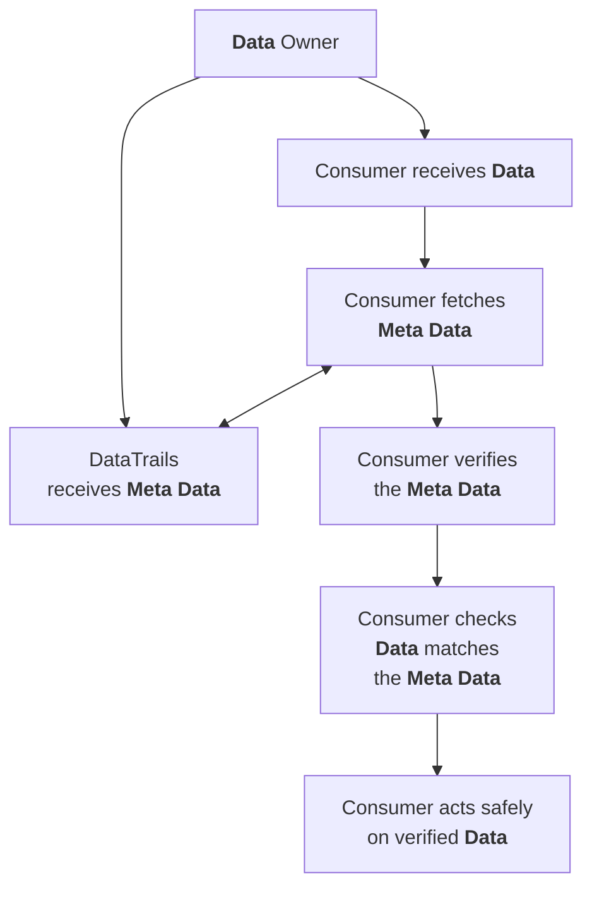
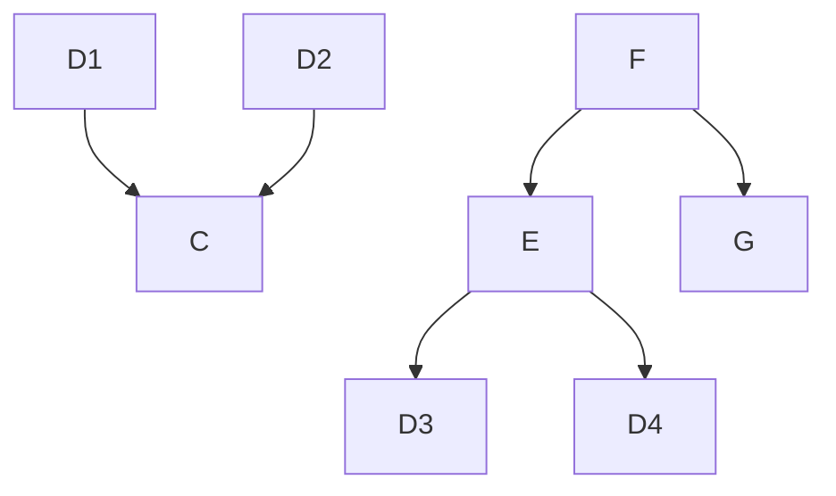
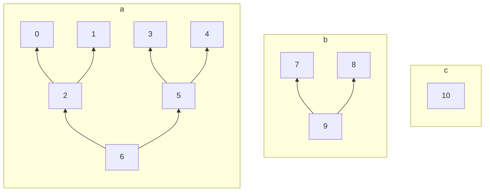

## Overview

## Origin Data, metadata, 

Data Artefact

Data Artefact Digest

Meta Data

Meta Data Record

Meta Data Digest

Verifiable Log Entry

Shared Meta Data Record

Transfered Data Artefact (Copy)

Origin Data, Meta Data, Meta Data Record (Data Trails), Shared Meta Data Record
Transfered Data (Out of band copy of original data
2nd Copy (Auditor, Escrow, Relying Party)
p

presciption

### Using Meta Data to act safely on Data

To cause the consumer to act on a malicios Data, the following need to be accomplished:

1. The source of the Data, which may not be the Owner, must be compromised to substitute the malicious Data.
1. The DataTrails database must be compromised.
1. The DataTrails ledger must be compromised and re-built and re-signed.

Defenses

1. Owner authentication of the Data, such as adding a signed digest in the Meta Data.
1. Obtaining and storing a Reciept for all items of interest.
1. Maintaining a replica of the verifiable log data and it's seals.

Incorporating any one of these measures eliminates the need for the consumer to trust Data Trails when chosing to act on data.

Maintaing a replica of the verifiable log and it's seals ensures continued ability to provide proof data is correct.

Additionally retaining a copy of the meta data, ensures continued operation even if trust in Data Trails breaks down.

Replicator provides proofs.
Parties trusted with the original data can get those proofs independently of detatrails.

### Receipts

Receipts are signed by both the Owner and DataTrails.
The Owner obtains a Receipt and makes it available to Consumers.

To safely act on verified data, the consumer must check the Meta Data retrieved from Data Trails matches the Receipt.
To later prove to others that the action was taken on verified data, the Receipt must be retained.
To later prove to others, in the case where DataTrails is unavailble or compromised, both the Receipt and the Meta Data must be retained by the Consumer.

|  Goal                                     | Necessary Trust
|-------------------------------------------|-------------------------------------------|
| Act safely on verified data               | None
| Prove actions were taken on verified data | DataTrails Database is un-compromised |
| Independently prove actions were taken on \
  verified data |

### Replicated Logs

Replicate Logs include cryptographic attestation from DataTrails to everying in the log.

To safely act on verified data, 
To safely act on verified data, the consumer must check the Meta Data retrieved from Data Trails is verified by the locally replicated log.

To later prove to others that the action was taken on verified data, the Consumer must retain portion of the log that verifies the Meta Data.

Replicated logs, or relevant subsections, can be obtained from DataTrails at any time without authentication.
New records in the DataTrails plaform are attested in the verifiable log within seconds of being successfully submited.
The Owner does not need to take any action to enable this protection.

A replicated log is equivalent, from a security perspective, to a set of receipts for all entries in the log.

## Problems we solve for people relying on individual data artifacts

a) Prevent un-safe actions due to corrupted or falsified records

b) Prove that all actions were taken based on verifiable records

* Knowing the data is correct

HASH(Origin Data) -> Meta Data.origin_data_hash -> POST -> Meta Data Record

GET Meta Data Record

HASH(Transfered Data) == Meta Data.origin_data_hash

You have to get the meta data record at some point.

To ensure actions are carried out only on verifiable data fetch the meta data on demand.
To be safe against acting on bad information, only a) is required, the Meta Data can be discarded.

To prove to others actions were always taken on good information, without relying on DataTrails in any way, b) is required and the Meta Data must be retained.
Get it as soon as you can and keep it.

Add to meta data

## Examples

### Acting on verifiable instruction

Ensure that no action is performed unless a verifiable record of the instruction

### Failure modes

The act is performed and no verifiable record of it exists.

## Roles
Claimant
Log Operator
Relying Party
Verifier
Auditor

## Glossary

