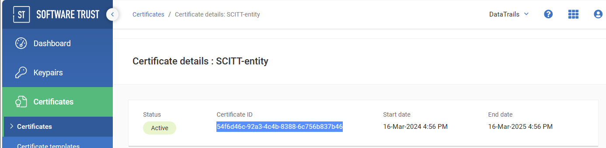
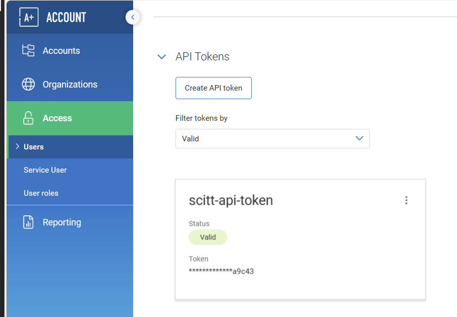
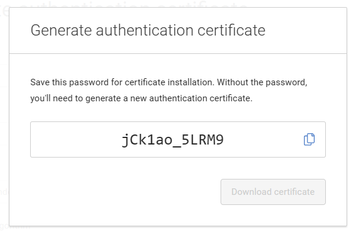


DigiCert Software Trust Manager is production supported. The DataTrails SCITT API is currently in preview and subject to change.


This quickstart will:

1. use an the DigiCert Software Trust Manager to remotely sign SCITT statements
1. register a signed statement for an artifact
1. query a collection of statements about the artifact

## Prerequisites

- [A DataTrails subscription](https://app.datatrails.ai/signup)
- [A DigiCert Software Trust Manager account](https://www.digicert.com/software-trust-manager)
- [DataTrails sample code](#datatrails-sample-code)
- [Environment Configuration](#environment-configuration)

### DigiCert Software Trust Manager Configuration

To configure the SCITT Action, the following Software Trust Manager (STM) environment variables are required:

- `DIGICERT_STM_CERTIFICATE_ID`
- `DIGICERT_STM_API_KEY`
- `DIGICERT_STM_API_BASE_URI`
- `DIGICERT_STM_API_CLIENTAUTH_P12_B64`
- `DIGICERT_STM_API_CLIENTAUTH_P12_PASSWORD`

To get the above variables


Note: follow up with corey for prod## `DIGICERT_STM_CERTIFICATE_ID`
https://clientauth.demo.one.digicert.com/signingmanager


## `DIGICERT_STM_API_KEY`

## `DIGICERT_STM_API_CLIENTAUTH_P12_B64`


- Save the token, the name doesn't matter


## `DIGICERT_STM_API_BASE_URI`

Note: follow up with corey for prod
https://clientauth.demo.one.digicert.com/signingmanager

1. Sign into the [DigiCert portal](https://demo.one.digicert.com/certificate-authority/ca/root)

## `DIGICERT_STM_API_CLIENTAUTH_P12_B64`


base64 the file into the github action secret

## `DIGICERT_STM_API_CLIENTAUTH_P12_PASSWORD`

- Came from the creation of the certificate


### DataTrails Sample Code

The Quickstart uses existing samples and scripts to focus on the SCITT APIs.

Clone the [DataTrails SCITT Examples](https://github.com/datatrails/datatrails-scitt-samples) repository to copy those files to your environment.

  ```bash
  git clone https://github.com/datatrails/datatrails-scitt-samples.git && \
  cd datatrails-scitt-samples
  ```

## Environment Configuration

1. Create a Python Virtual Environment for the sample scripts and install the dependencies

    ```bash
    python -m  venv venv && \
    source venv/bin/activate && \
    pip install --upgrade pip && \
    pip install -r requirements.txt
    ```

1. To ease copying and pasting commands, update any variables to fit your environment

    ```bash
    # your identity
    ISSUER="sample.synsation.io"

    # signing key to sign the SCITT Statements
    SIGNING_KEY="my-signing-key.pem"

    # File representing the signed statement to be registered
    SIGNED_STATEMENT_FILE="signed-statement.cbor"

    # Feed ID, used to correlate a collection of statements about an artifact
    FEED="my-product-id"
    ```

1. Create a [bearer_token](/developers/developer-patterns/getting-access-tokens-using-app-registrations) stored as a file, in a secure local directory with 0600 permissions.

## Create a Microsoft Trusted Service Signing Key


If you already have a Trusted Signing Key, skip ahead to [Generating a Payload](#generating-a-payload)


1. Find the region URL for your configured Trused Signing Resource
    |Region | Region Class Fields	| Endpoint URI valuemeta |
    | - | - | -  |
    | East US | EastUS | https://eus.codesigning.azure.net |
    | West US | WestUS | https://wus.codesigning.azure.net |
    | West Central US |	WestCentralUS	| https://wcus.codesigning.azure.net |
    | West US 2 | WestUS2 | https://wus2.codesigning.azure.net |
    | North Europe | NorthEurope | https://neu.codesigning.azure.net |
    | West Europe | WestEurope | https://weu.codesigning.azure.net |

1. Create Variables (Note these values must match the verified account)

   ```bash
   TSS_ACCOUNT="synsation"
   TSS_RG="synsation-signing"
   TSS_RG_LOCATION="westeu"
   TSS_PROFILE="synsationdemo"
   TSS_OU="Synsation Manufacturing"
   TSS_CN="synsation.io"
   TSS_O=$TSS_CN
   AD_ASSIGNED_GROUP="Azure Demo Team"
   TSS_ENDPOINT="https://weu.codesigning.azure.net"
   ```


1. Create a Certificate Profile

    ```bash
    az codesigning certificate-profile create \
      --resource-group "$TSS_RG" \
      --profile-type PrivateTrust \
      --account-name "$TSS_ACCOUNT" \
      --name "$TSS_PROFILE" \
      --common-name "$TSS_CN" \
      --organization "$TSS_O" \
      --organization-unit "$TSS_OU"
    ```

1. List Existing Accounts

    ```bash
      az codesigning show -g $TSS_RG -n $TSS_ACCOUNT
    ```

1. List the existing profile

    ```bash
    az codesigning certificate-profile show \
      --resource-group "$TSS_RG" \
      --account-name "$TSS_ACCOUNT" \
      --name "$TSS_PROFILE" \
      -o jsonc
    ```

1. Get the AD Object ID to Assign Permissions

   ```bash
   AD_OBJECT_ID=$(az ad group show -g "$AD_ASSIGNED_GROUP" -o tsv --query id)
   ```

1. Get the Subscription ID

    ```bash
    SUBSCRIPTION_ID=$(az account show --query id --output tsv)
    ```

1. Assign Roles

    ```bash
    az role assignment create \
      --assignee $AD_OBJECT_ID \
      --role "Code Signing Certificate Profile Signer" \
      --scope "/subscriptions/$SUBSCRIPTION_ID/resourceGroups/$TSS_RG/providers/Microsoft.CodeSigning/codeSigningAccounts/$TSS_ACCOUNT/certificateProfiles/$TSS_PROFILE"

    ```

## Signing with SignTool

1. Create a configuration file for signing

    ```bash
    cat > tss-config.json <<EOF
    {
      "Endpoint": "$TSS_ENDPOINT",
      "CodeSigningAccountName": "$TSS_ACCOUNT",
      "CertificateProfileName": "$TSS_PROFILE",
      "CorrelationId": "$FEED"
    }
    EOF

    ```

signtool sign /v /debug /fd SHA256 /tr "http://timestamp.acs.microsoft.com" /td SHA256 "Azure.CodeSigning.Dlib.dll" /dmdf "tss-config.json" "tss-config.json"

For the Quickstart, create a testing [COSE Key](https://cose-wg.github.io/cose-spec/#key-structure) which DataTrails will cryptographically validate upon registration

  ```bash
  openssl ecparam -name prime256v1 -genkey -out $SIGNING_KEY
  ```

## Generating a Payload

1. Create a simple json payload

    ```bash
    cat > payload.json <<EOF
    {
        "author": "fred",
        "title": "my biography",
        "reviews": "mixed"
    }
    EOF
    ```

1. Create a COSE Signed Statement for the `payload.json` file

    ```bash
    python scitt/create_signed_statement.py \
      --signing-key-file $SIGNING_KEY \
      --issuer $ISSUER \
      --feed $FEED \
      --content-type "application/json" \
      --payload-file payload.json \
      --output-file $SIGNED_STATEMENT_FILE

1. Register the Statement

    ```bash
    OPERATION_ID=$(curl -X POST -H @$HOME/.datatrails/bearer-token.txt \
                    --data-binary @$SIGNED_STATEMENT_FILE \
                    https://app.datatrails.ai/archivist/v1/publicscitt/entries \
                    | jq -r .operationID)
    ```

1. Monitor for the Statement to be anchored. Once `"status": "succeeded"`, proceed to the next step

    ```bash
    ENTRY_ID=$(python scitt/check_operation_status.py --operation-id $OPERATION_ID)
    ```

1. Retrieve a SCITT Receipt

    ```bash
    
    curl -H @$HOME/.datatrails/bearer-token.txt \
      https://app.datatrails.ai/archivist/v1/publicscitt/entries/$ENTRY_ID/receipt \
      -o receipt.cbor
    ```

## Retrieve Statements for the Artifact

The power of SCITT is the ability to retrieve the history of statements made for a given artifact.
By querying the series of statements, consumers can verify who did what and when for a given artifact.

1. Query DataTrails for the collection of statements

    ```bash
    curl -H @$HOME/.datatrails/bearer-token.txt \
      https://app.datatrails.ai/archivist/v2/publicassets/-/events?event_attributes.feed_id=$FEED | jq
    ```


Coming soon: Filter on specific content types, such as what SBOMs have been registered, or which issuers have made statements.


## Summary

The quickstart created a collection of statements for a given artifact.
Over time, as new information is available, authors can publish new statements which verifiers and consumers can benefit from.
There are no limits to the types of additional statements that may be registered, which may include new vulnerability information, notifications of new versions, end of life (EOL) notifications, or more.
By using the content-type parameter, verifiers can filter to specific types, and/or filter statements by the issuer.

For more information:

<!-- - [DataTrails SCITT API Reference](TBD) -->
- [SCITT.io](SCITT.io)
